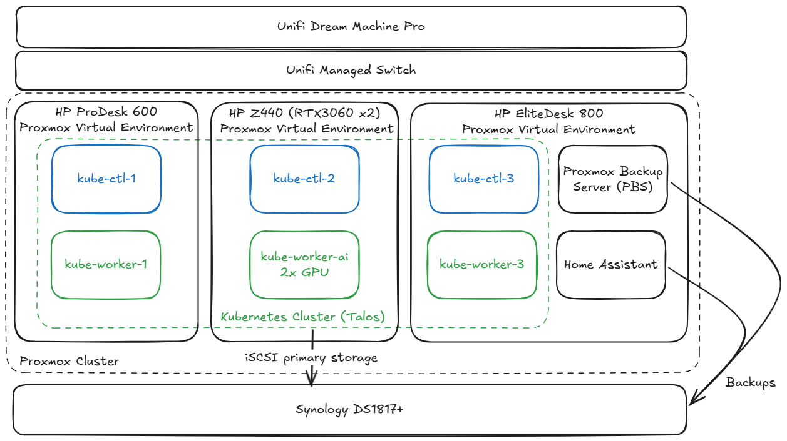
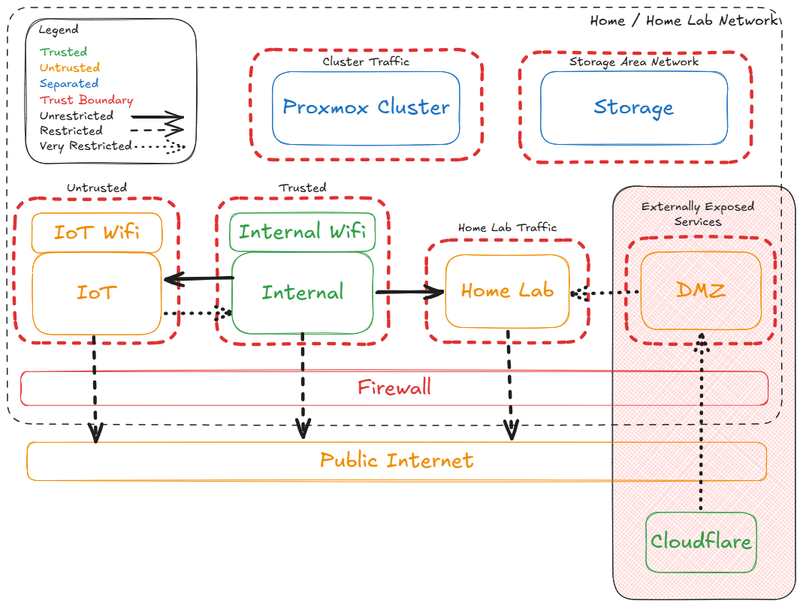
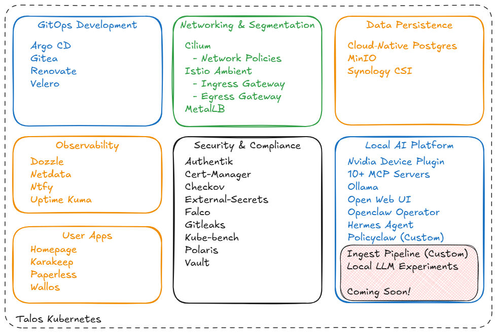

# Architecture Diagrams

Diagrams are created in [Excalidraw](https://excalidraw.com).

---

## Physical Architecture

Three HP workstations form a Proxmox cluster, each running Talos VMs for the Kubernetes control plane and workers. The HP Z440 hosts the GPU worker (`kube-worker-ai`) with dual RTX 3060s for local LLM inference. The HP EliteDesk 800 also runs the Proxmox Backup Server (PBS) and Home Assistant VMs. All cluster nodes connect to a Synology DS1817+ for iSCSI primary storage, which also receives Proxmox VM backups.

---

## Network Layout

The network is segmented into trust zones enforced at the firewall:

| Zone | Trust Level | Notes |
|---|---|---|
| Internal | Trusted | Primary LAN; unrestricted access to Home Lab |
| Internal WiFi | Trusted | Wireless extension of Internal |
| Home Lab | Separated | Kubernetes cluster traffic; very restricted DMZ access |
| IoT | Untrusted | Isolated; Internal can push to it, not pull |
| IoT WiFi | Untrusted | Wireless extension of IoT |
| DMZ | Untrusted | Externally exposed services only; Cloudflare fronted |
| Proxmox Cluster | Separated | Inter-node cluster traffic |
| Storage Area Network | Separated | iSCSI traffic to Synology |

---

## Platform View

The Talos Kubernetes platform is organised into seven capability areas:

| Area | Components |
|---|---|
| **GitOps Development** | Argo CD, Gitea, Renovate, Velero |
| **Networking & Segmentation** | Cilium (network policies), Istio Ambient (ingress + egress gateways), MetalLB |
| **Data Persistence** | CloudNative PG, MinIO, Synology CSI |
| **Observability** | Dozzle, Netdata, Ntfy, Uptime Kuma |
| **Security & Compliance** | Authentik, Cert-Manager, Checkov, External-Secrets, Falco, Gitleaks, Kube-bench, Polaris, Vault |
| **Local AI Platform** | Nvidia Device Plugin, Ollama, Open Web UI, 10+ MCP Servers, Openclaw Operator, Hermes Agent, Policyclaw (custom) |
| **User Apps** | Homepage, Karakeep, Paperless, Wallos |
