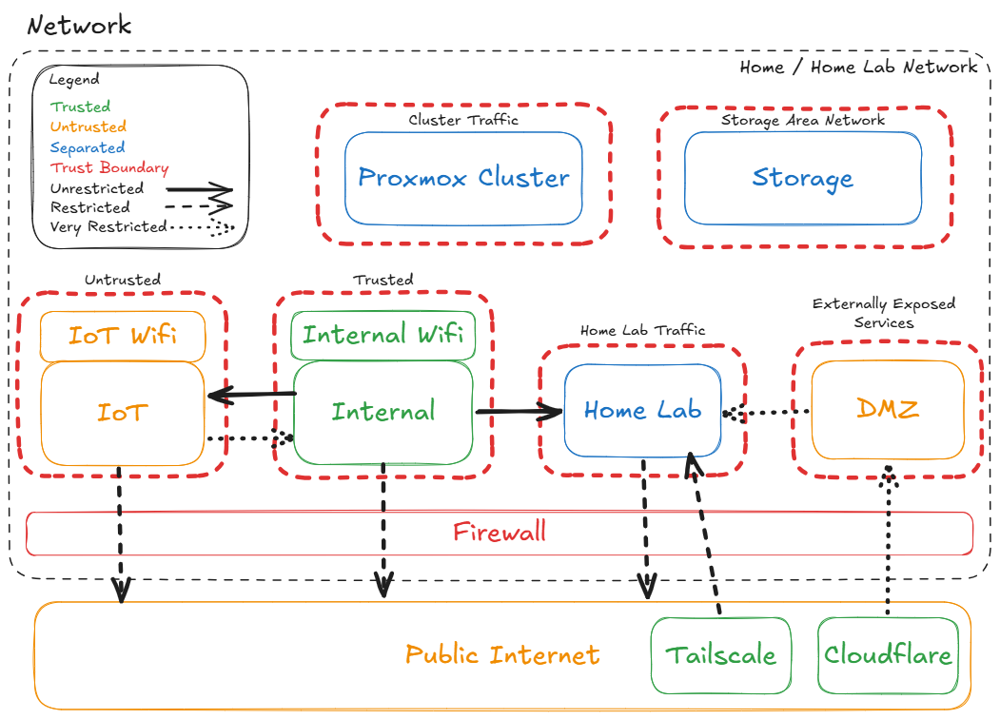
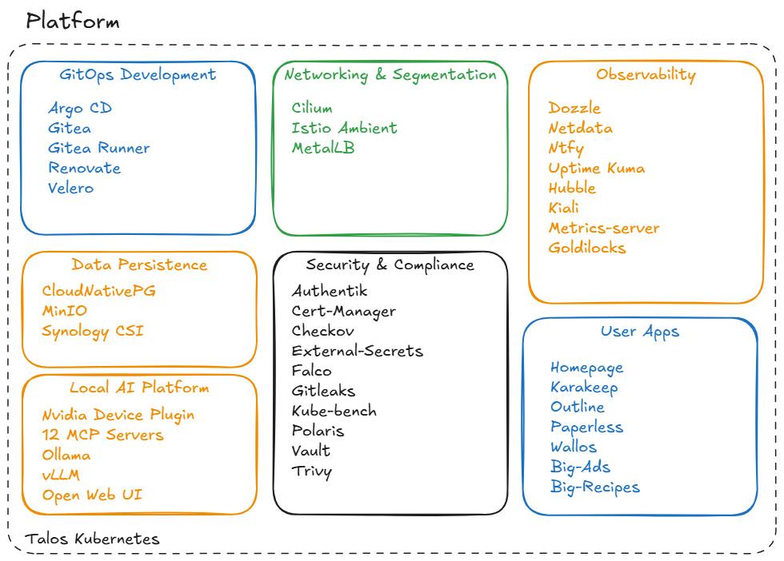
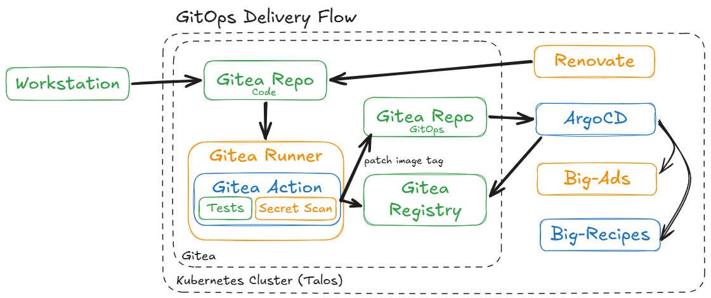
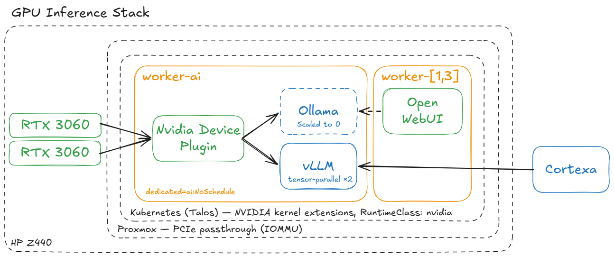

Diagrams are created in [Excalidraw](https://excalidraw.com).

---

## Physical Architecture

Three HP workstations form a Proxmox cluster, each running Talos VMs for the Kubernetes control plane and workers. The HP Z440 hosts the GPU worker (`kube-worker-ai`) with dual RTX 3060s for local LLM inference. The HP EliteDesk 800 also runs the Proxmox Backup Server (PBS) and Home Assistant VMs. All cluster nodes connect to a Synology DS1817+ for iSCSI primary storage, which also receives Proxmox VM backups.

---

## Network Layout

The network is segmented into trust zones enforced at the firewall:

| Zone | Trust Level | Notes |
|---|---|---|
| Internal | Trusted | Primary LAN; unrestricted access to Home Lab |
| Internal WiFi | Trusted | Wireless extension of Internal |
| Home Lab | Separated | Kubernetes cluster traffic; very restricted DMZ access |
| IoT | Untrusted | Isolated; Internal can push to it, not pull |
| IoT WiFi | Untrusted | Wireless extension of IoT |
| DMZ | Untrusted | Externally exposed services only; Cloudflare fronted |
| Proxmox Cluster | Separated | Inter-node cluster traffic |
| Storage Area Network | Separated | iSCSI traffic to Synology |

**Two ingress paths, two jobs.** A **Cloudflare Tunnel** fronts the handful of deliberately public hostnames, terminating in the DMZ. A **Tailscale subnet router** advertises the LAN into a private tailnet, which is how I administer the platform remotely — no open inbound ports, and admin interfaces never reach the public internet at all. Neither path is a fallback for the other; the reasoning is in [ADR 015](../decisions/015-tailscale-remote-access/).

---

## Platform View

The Talos Kubernetes platform is organised into seven capability areas:

| Area | Components |
|---|---|
| **GitOps Development** | Argo CD, Gitea, Gitea Runner, Renovate, Velero |
| **Networking & Segmentation** | Cilium, Istio Ambient, MetalLB |
| **Data Persistence** | CloudNativePG, MinIO, Synology CSI |
| **Observability** | Dozzle, Netdata, Ntfy, Uptime Kuma, Hubble, Kiali, metrics-server, Goldilocks |
| **Security & Compliance** | Authentik, Cert-Manager, Checkov, External-Secrets, Falco, Gitleaks, Kube-bench, Polaris, Trivy, Vault |
| **Local AI Platform** | Nvidia Device Plugin, 12 MCP Servers, Ollama, vLLM, Open Web UI |
| **User Apps** | Homepage, Karakeep, Outline, Paperless, Wallos, big-ads, big-recipes |

Two things this map deliberately does *not* show. The **Tailscale subnet router** is absent because it runs in an LXC beside the cluster rather than on it — that separation is the whole point of [ADR 015](../decisions/015-tailscale-remote-access/). And **[Cortexa](../../projects/cortexa/)** is absent because it isn't deployed here; it runs from a local venv and consumes the platform's Postgres and inference endpoint from outside.

---

## GitOps Delivery Flow

How a change actually reaches production. The distinctive part is the **two-repository handoff**: CI doesn't deploy anything. It builds an image, pushes it to the in-cluster registry, then **clones the GitOps repo and patches the image tag** in the deployment manifest. ArgoCD notices the manifest change and reconciles. Nothing is ever applied directly to the cluster.

Note where the boundary sits: the Git server, the runner, and the container registry all live **inside the cluster they deploy to**. That circularity is deliberate and its recovery implications are covered in [ADR 002](../decisions/002-self-hosted-gitea-ci/). Renovate feeds dependency updates into the same loop, so a base-image bump travels the identical path as a hand-written commit — through tests, secret scanning, and a manifest patch.

[big-ads](../../projects/big-ads/) has shipped nine releases through this pipeline with no manual steps.

---

## GPU Inference Stack

The layered chain behind local inference, and the reason it took real work to get right: **every boundary in this diagram is a layer that can fail silently and look like the next layer's problem.** PCIe passthrough with correct IOMMU grouping at the Proxmox layer, NVIDIA kernel extensions baked into a custom Talos image, the device plugin advertising `nvidia.com/gpu` to the scheduler, and finally CUDA inside the container. The `dedicated=ai:NoSchedule` taint keeps everything else off the node.

Both RTX 3060s are driven as one pool: vLLM runs **tensor-parallel across the pair**, which is what makes a quantized 30B model fit at all. The GPU Ollama deployment is scaled to zero — the two runtimes divide the work rather than sharing the silicon ([ADR 014](../decisions/014-vllm-inference/)).

The dashed line is honest about a migration in progress: Open WebUI still points at the Ollama endpoint and hasn't been repointed to vLLM's OpenAI-compatible API. [Cortexa](../../projects/cortexa/) sits outside the hardware boundary entirely — it runs on my workstation and reaches vLLM through an external gateway provisioned for exactly that purpose.
